<div align="center">



<br><br>

<h3>
<code>manoj@github ~ $ whoami</code>
</h3>

<table>
<tr>
<td valign="top">

</td>

<td valign="top">

</td>
</tr>
</table>

<br>

</div>

---

## `manoj@github ~ $ cat about.txt`

**Full Stack Developer** focused on building responsive, database-driven web applications with **React.js, Next.js, Node.js, Express.js, and MongoDB**.

I enjoy turning ideas into practical products — from polished frontend interfaces to REST APIs, database-driven applications, and custom CMS systems.

Currently working as a **Full Stack Developer Intern at CubeStaX**, working across React/Next.js interfaces, serverless API routes, Supabase/PostgreSQL, CMS functionality, deployment workflows, validation, and notifications.

---

## `manoj@github ~ $ tech --stack`

```text
Frontend   → React.js · Next.js · Tailwind CSS · React Router
Backend    → Node.js · Express.js · REST APIs · API Integration
Database   → MongoDB · Mongoose · PostgreSQL
React      → Hooks · Context API · State Management
Languages  → JavaScript · HTML5 · CSS3 · SQL
Tools      → Git · GitHub · Vercel · Axios · Cloudinary
```

---

## `manoj@github ~ $ ls projects`

### `01` · CubeStaX

**Official company website & custom CMS**

`React.js` · `Next.js` · `Supabase` · `PostgreSQL` · `Tailwind CSS`

Built and deployed the official company website with a custom admin panel that allows content, sections, text, and images to be updated without changing code.

---

### `02` · BorrowBox

**Full-stack MERN campus sharing platform**

`React.js` · `Node.js` · `Express.js` · `MongoDB` · `Mongoose` · `Tailwind CSS` · `Cloudinary`

A campus platform for borrowing, lending, donating, and requesting items with authentication, listings, dashboards, request management, protected flows, persistent sessions, and image uploads.

---

## `manoj@github ~ $ achievements`

🏆 **Runner-Up — Tata Crucible Campus Quiz Cluster Finals (2025)**  
Secured INR 18,000 in a multi-round competitive business quiz.

🏆 **Runner-Up — College Web Design Competition (2024)**  
Recognized for innovative and fully responsive UI/UX implementation.

---

## `manoj@github ~ $ connect`

<p align="left">
<a href="https://github.com/manojrahar">

</a>
<a href="https://www.linkedin.com/in/manoj-rahar">

</a>
<a href="mailto:manojrahar003@gmail.com">

</a>
</p>

<br>

<sub>Built with SVG, Python and a little terminal obsession.</sub>